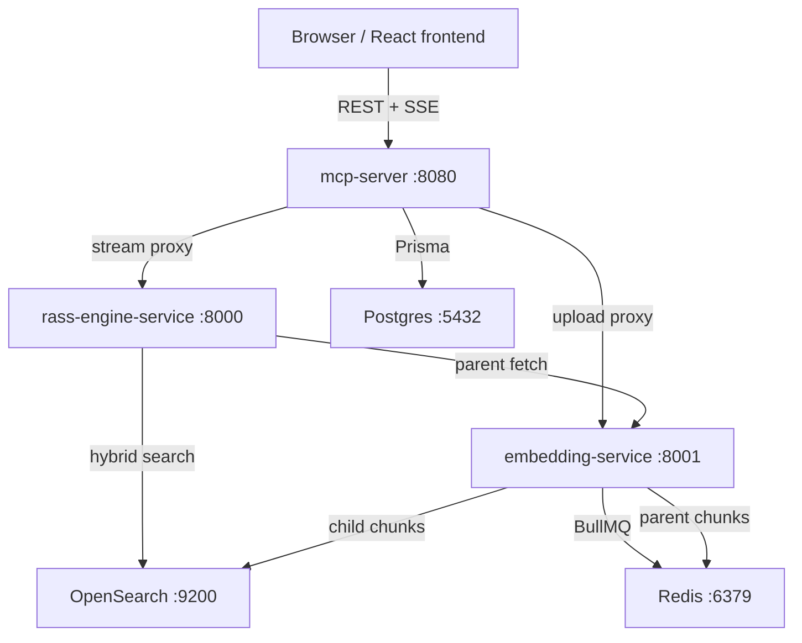

# RASS (Retrieval-Augmented Semantic Search)

CoRAG is a multi-service RAG platform for document ingestion, retrieval, and grounded chat. The current codebase is centered around three backend services plus a React frontend:

- `mcp-server`: auth, API gateway, chat persistence, document registry, knowledge bases, workspaces, admin APIs, and MCP transport
- `rass-engine-service`: retrieval pipeline and answer generation
- `embedding-service`: async ingestion, chunking, embedding, indexing, and provenance callbacks
- `frontend`: React chat UI, usually run separately in local development

This README describes the code as it exists now. Older phase-oriented writeups in the repo are historical context, not the primary source of truth.

## Current Architecture



## Service Responsibilities

### `mcp-server`

- Issues short-lived JWTs and rotating refresh-token cookies
- Accepts `Authorization: Bearer <jwt>` and `Authorization: ApiKey <raw_key>`
- Stores users, chats, messages, documents, provenance, feedback, annotations, entities, relations, workspaces, API keys, refresh tokens, audit logs, and shared-chat metadata in Postgres via Prisma
- Proxies uploads to `embedding-service`
- Proxies streaming queries to `rass-engine-service`
- Exposes REST routes for chats, documents, knowledge bases, organizations, workspaces, admin/compliance, feedback, annotations, knowledge graph extraction, and MCP transport

### `rass-engine-service`

- Exposes `POST /ask` and `POST /stream-ask`
- Uses the current staged retrieval pipeline:
  - `HydeQueryExpansionStage`
  - `EmbedQueryStage`
  - `HybridSearchStage`
  - `ParentFetchStage`
  - `DeduplicateStage`
  - `RerankStage`
  - `FeedbackBoostStage`
  - `TopKSelectStage`
- Streams OpenAI-style SSE chunks:
  - `context` metadata first
  - token deltas next
  - `citations` metadata last
  - `[DONE]` sentinel at the end

### `embedding-service`

- Accepts uploads and immediately enqueues BullMQ ingestion jobs
- Worker flow is parse -> chunk -> embed -> index -> provenance callback
- Stores parent chunks in Redis and child chunks in OpenSearch
- Supports OCR fallback for images and scanned PDFs when `VISION_ENABLED: true`
- Exposes job status and Bull Board in non-production

### `frontend`

- React 19 + MUI single-page app
- Uses in-memory JWT state plus an HTTP-only refresh-token cookie
- Streams assistant responses into the chat UI
- Includes document management, context panel, guided tour, and shared-chat route code

## Runtime Ports

The root `docker-compose.yml` currently exposes:

| Service | Host Port | Notes |
| --- | --- | --- |
| `mcp-server` | `8080` | Main API surface |
| `rass-engine-service` | `8000` | Internal query engine |
| `embedding-service` | `8001` | Internal ingestion service |
| `opensearch` | `9200` | Search cluster |
| `redis` | `6379` | Queue + docstore |
| `db` | `5432` | Postgres |
| `jaeger` | `16686` | Trace UI |
| `prometheus` | `9090` | Metrics |
| `grafana` | `3001` | Dashboards |
| `loki` | `3100` | Log backend |
| `ollama` | `11434` | Optional local models |

Important: the root compose stack does not currently run the standard React frontend. For local UI work, run `frontend` separately. The demo compose attempts to include a frontend service, but that flow is not the canonical local-development path.

## Data Placement

- Postgres: application state and governance data
- OpenSearch: searchable child chunks and hybrid retrieval
- Redis: BullMQ queues and parent chunk storage

Core Prisma models include:

- `User`, `Chat`, `Message`, `ChatDocument`
- `Document`, `DocumentProvenance`
- `KnowledgeBase`, `KBMember`
- `Organization`, `OrgMember`, `Workspace`, `WorkspaceMember`
- `ApiKey`, `RefreshToken`, `AuditLog`
- `RetrievalFeedback`, `Entity`, `Relation`, `Annotation`, `SharedChat`

## Core Flows

### Auth

1. `POST /api/auth/login` returns a short-lived JWT and sets an HTTP-only refresh-token cookie.
2. The frontend stores the JWT in memory only.
3. On reload, the frontend calls `POST /api/auth/refresh` with `withCredentials: true`.
4. `POST /api/auth/logout` invalidates the refresh token and clears the cookie.

### Upload and Ingestion

1. Client uploads a file to `POST /api/embed-upload` on `mcp-server`.
2. `mcp-server` creates a `Document` row with status `QUEUED`.
3. The file is forwarded to `embedding-service`.
4. `embedding-service` writes the file to disk, enqueues a BullMQ job, and returns `202 Accepted`.
5. The worker parses, chunks, embeds, indexes, writes provenance, and calls back into `mcp-server` internal routes.
6. Clients poll `GET /api/ingest/status/:jobId`.

### Query and Streaming

1. Client sends `POST /api/stream-ask`.
2. `mcp-server` forwards the request and user identity to `rass-engine-service`.
3. The retrieval pipeline runs and selects source documents.
4. The engine streams:
   - retrieved context metadata
   - answer tokens
   - structured citations
   - `[DONE]`

## Local Development

### Prerequisites

- Docker with Compose support
- Node.js 18+
- A root `.env` file with secrets
- `shared_rass_network` Docker network created once:

```bash
docker network create shared_rass_network
```

### Configure

`config.yml` at the repo root is the shared non-secret config for all backend services.

Put secrets in `.env`, for example:

```env
OPENAI_API_KEY=...
GEMINI_API_KEY=...
JWT_SECRET=...
REFRESH_TOKEN_SECRET=...
DATABASE_URL=postgresql://rass_user:rass_password@db:5432/rass_db
```

### Start the backend stack

```bash
./scripts/start.sh
```

That runs:

```bash
docker-compose up -d --build
```

The `mcp-server` container runs `npx prisma migrate deploy` on boot.

### Run the frontend locally

```bash
cd frontend
npm install
npm start
```

The frontend talks to `http://localhost:8080/api`.

### Stop the backend stack

```bash
./scripts/stop.sh
```

## Commands and Scripts

### Top-level scripts

- `scripts/start.sh`: starts the root backend stack
- `scripts/stop.sh`: stops the root backend stack
- `scripts/demo.sh`: starts the demo compose flow
- `scripts/ollama-pull-models.sh`: pulls local Ollama models

### Service commands

- `embedding-service`: `npm start`, `npm test`
- `rass-engine-service`: `npm start`, `npm test`
- `mcp-server`: `npm test`, `npm run validate:api`
- `frontend`: `npm start`, `npm test`, `npm build`

## Observability

The current stack includes:

- OpenTelemetry in all three Node services
- Prometheus metrics at `/metrics`
- Jaeger trace collection
- Grafana dashboards
- Loki + Promtail log aggregation
- Product-level audit logging in `AuditLog`

Useful URLs in local development:

- API health: `http://localhost:8080/api/health`
- Swagger UI: `http://localhost:8080/api/docs`
- Bull Board: `http://localhost:8001/admin/queues`
- Jaeger: `http://localhost:16686`
- Prometheus: `http://localhost:9090`
- Grafana: `http://localhost:3001`

## Known Limitations

These are current code realities and should be treated as such:

- The root compose stack does not include the normal frontend service.
- Per-KB and per-workspace ingestion exists, but the active `HybridSearchStage` still searches the configured default OpenSearch index rather than dynamically switching to a KB/workspace index.
- The shared-chat backend route currently selects `role` and `content` fields even though the Prisma `Message` model uses `sender` and `text`. Treat shared chats as incomplete.
- The repo contains two distinct "knowledge graph" concepts:
  - an older document-similarity graph route in `knowledgeBases.js`
  - the newer entity/relation graph in `knowledgeGraph.js`
- Some frontend components still assume legacy token handling. The canonical auth model is in-memory JWT + refresh cookie.
- Document deletion is a soft-delete plus best-effort search cleanup. Redis parent chunks are not comprehensively purged in the normal delete flow.
- `POST /api/chat/completions` is intended for OpenAI-compatible integrations and forwards unscoped requests to the engine.

## Where To Read Next

- Step-by-step setup and usage: `docs/getting-started.md`
- Current architecture walkthrough: `docs/PLANNER_AND_DIAGRAMS.md`
- Deployment details: `DEPLOYMENT.md`
- User-facing behavior: `docs/user-guide.md`
- Streaming protocol: `docs/api/streaming.md`
- Service-specific notes:
  - `mcp-server/README.md`
  - `rass-engine-service/README.md`
  - `embedding-service/README.md`
  - `frontend/README.md`
