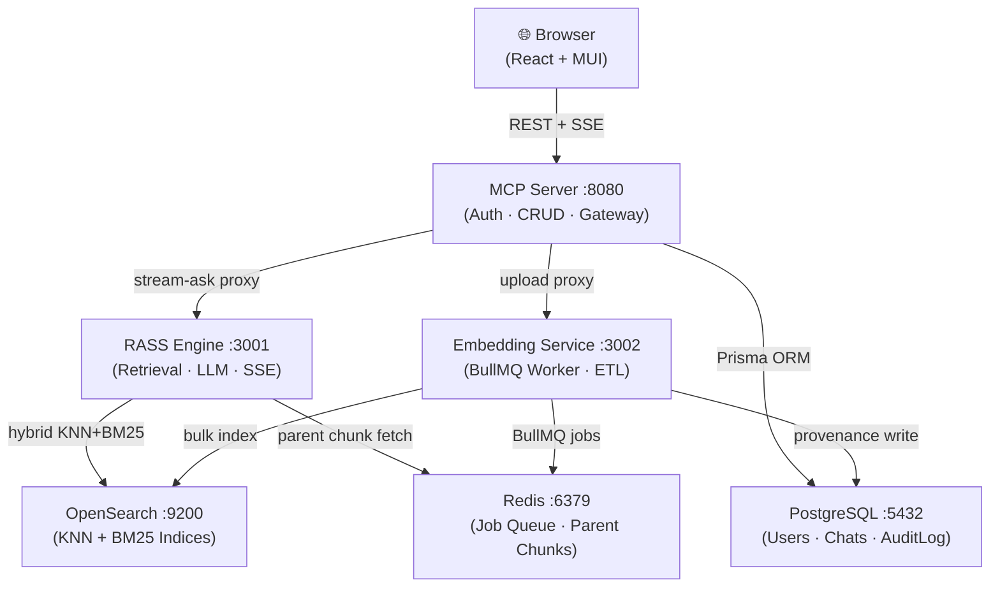

# RASS (Retrieval-Augmented Semantic Search)

A production-grade, multi-service Retrieval Augmented Generation (RAG/RASS) system with document ingestion, hybrid retrieval, SSE streaming, and a polished React frontend. It's built for clarity and reproducibility: one configuration file, containerized services, and sensible defaults.

## What you get

- Multi-provider embeddings (OpenAI or Gemini) with correct vector dimensioning
- **Async document ingestion** via BullMQ job queue (no more HTTP timeouts on large files)
- **Document registry** with lifecycle tracking (QUEUED → PROCESSING → READY → FAILED)
- **ETL provenance** records for every ingested document (SHA-256, stage timings, chunking config, embedding model)
- **Configurable chunking strategies**: `fixed_size`, `recursive_character`, `sentence_window` — selectable via `config.yml`
- **Bring-Your-Own Knowledge Base (BYO KB)**: per-user/team knowledge bases with dedicated OpenSearch indices
- **Multi-tenant workspaces** with per-workspace OpenSearch indices and strict data isolation
- **RBAC** — Viewer / Editor / Admin roles with permission-checked routes and automatic audit denial logging
- **Enterprise audit logging** — tamper-evident append-only `AuditLog` with IP, user-agent, resourceType; CSV export for compliance
- **API key authentication** — machine-to-machine auth; raw key shown once, only hash stored
- **Refresh token rotation** — short-lived JWTs (15 min) + rotating HTTP-only refresh token cookie (7-day)
- **Data retention & right-to-erasure** — per-workspace `retentionDays` policy, nightly purge sweep, `DELETE /api/users/:id/data`
- Hybrid retrieval over OpenSearch (KNN + keyword) scoped per-user / per-KB / per-workspace
- Redis-backed parent-doc store for fast parent retrieval
- Postgres + Prisma for auth, chats, and document registry
- MCP gateway with REST endpoints and OpenAI-compatible stream proxy
- React frontend with uploads, live progress polling, document library with status badges, streaming citations

See deep-dive diagrams and flows in docs/PLANNER_AND_DIAGRAMS.md.

---

## Architecture at a glance



Services (all configured from root `config.yml` and secrets from `.env`):
- **embedding-service (3002)**: ingest → BullMQ queue → worker (parse → chunk → embed → index child chunks in OpenSearch + store parents in Redis) → provenance record.
- **rass-engine-service (3001)**: retrieve via hybrid search + generate answer via LLM; SSE or JSON.
- **mcp-server (8080)**: gateway. REST auth, chat CRUD, document registry API, KB management API, stream proxy, upload proxy, and MCP /mcp tools.
- **frontend (3000)**: CRA app that talks to mcp-server.
- Infra: OpenSearch, Redis, Postgres (via Docker Compose).

Data rules:
- All searches are strictly filtered by metadata.userId (or KB / workspace membership).
- Parent chunks live in Redis keyed by UUID; child chunks are in OpenSearch with metadata including userId, originalFilename, uploadedAt, parentId, documentId, kbId, workspaceId.
- Chats/messages and the document registry are in Postgres. JWT is stored **in memory only** (not localStorage); an HTTP-only refresh-token cookie maintains sessions silently.

---

## Configuration Reference

All services share a root `config.yml`. Key settings:

| Key | Default | Description |
|-----|---------|-------------|
| `MCP_SERVER_PORT` | `8080` | MCP Server listening port |
| `RASS_ENGINE_PORT` | `3001` | RASS Engine listening port |
| `EMBEDDING_SERVICE_PORT` | `3002` | Embedding Service listening port |
| `OPENSEARCH_HOST` | `opensearch` | OpenSearch hostname |
| `OPENSEARCH_PORT` | `9200` | OpenSearch port |
| `REDIS_HOST` | `redis` | Redis hostname |
| `REDIS_PORT` | `6379` | Redis port |
| `EMBED_DIM` | `768` | Embedding vector dimension (768 for Gemini, 1536 for ada-002, 3072 for text-embedding-3-large) |
| `EMBEDDING_PROVIDER` | `gemini` | `gemini` or `openai` |
| `LLM_PROVIDER` | `gemini` | `gemini` or `openai` |
| `CHUNKING_STRATEGY` | `recursive_character` | `fixed_size`, `recursive_character`, or `sentence_window` |
| `CHUNK_SIZE` | `512` | Parent chunk size in tokens |
| `CHUNK_OVERLAP` | `50` | Overlap between consecutive chunks |
| `EMBED_WORKER_CONCURRENCY` | `4` | Parallel embedding workers |
| `TOP_K` | `5` | Chunks returned to LLM |
| `RERANK_TOP_K` | `20` | Candidates fetched before reranking |

Secrets (in `.env`, never in `config.yml`):
```
OPENAI_API_KEY=sk-...
GEMINI_API_KEY=...
JWT_SECRET=<random 64 char>
REFRESH_TOKEN_SECRET=<different random 64 char>
DATABASE_URL=postgresql://...
```

---

## Troubleshooting

### OpenSearch won't start (Exit 137 / Out of Memory)
```bash
# Increase vm.max_map_count (Linux/WSL)
sudo sysctl -w vm.max_map_count=262144
echo "vm.max_map_count=262144" | sudo tee -a /etc/sysctl.conf
```

### Document stuck in "Processing" forever
```bash
# Check embedding service worker logs
docker compose logs -f embedding-service
# Check Redis connectivity
docker compose exec redis redis-cli ping
```

### "Cannot find module" error on startup
```bash
# Rebuild with fresh node_modules
docker compose build --no-cache mcp-server
```

### JWT "invalid signature" after config change
The `JWT_SECRET` in `.env` must match what was used to sign existing tokens. After changing it, all sessions will be invalidated — users must log in again.

### Wrong vector dimension errors in OpenSearch
The `EMBED_DIM` in `config.yml` must match the embedding model:
- `text-embedding-004` (Gemini) → `768`
- `text-embedding-ada-002` (OpenAI) → `1536`
- `text-embedding-3-large` (OpenAI) → `3072`

Delete and recreate the OpenSearch index after changing `EMBED_DIM`.

---

## Quickstart

1) Prereqs
- Docker and Docker Compose
- Increase vm.max_map_count for OpenSearch (Linux/WSL): `sudo sysctl -w vm.max_map_count=262144`
- Create the external network once: `docker network create shared_rass_network`

2) Configure secrets and providers
- Copy or create a `.env` in the repo root with: `OPENAI_API_KEY`, `GEMINI_API_KEY`, `JWT_SECRET`, `DATABASE_URL`.
- Choose providers in `config.yml`: `EMBEDDING_PROVIDER`, `LLM_PROVIDER`, `SEARCH_TERM_EMBEDDING_PROVIDER`. Ensure `EMBED_DIM` matches the embedding model (Gemini → 768, OpenAI text-embedding-3-large → 3072).
- Choose chunking strategy: `CHUNKING_STRATEGY: recursive_character` (default) | `fixed_size` | `sentence_window`.

3) Start the stack
- `scripts/start.sh` (docker-compose up -d --build). First boot runs `prisma migrate deploy` in mcp-server and creates OpenSearch index if missing.

4) Open the app
- Frontend via http://localhost:8080. Register then login.

5) Try it
- Create a chat, upload a document (.pdf, .txt, .md, .docx) using the paperclip in the input.
- The upload returns immediately (202 Accepted). Watch the live progress bar: Queued → Parsing → Chunking → Embedding → Ready.
- Go to "My Documents" to see all documents with status badges and ETL provenance.
- Ask a question; watch SSE stream and citations.

---

## Phase B Features

### #109 — Async Document Ingestion Pipeline
- **Upload now returns 202 immediately** with a `{ jobId, documentId }` payload.
- BullMQ worker processes jobs asynchronously: parse → chunk → embed → index.
- **Progress polling**: frontend polls `GET /api/ingest/status/:jobId` every 2 s; shows 0 → 25 → 50 → 75 → 100% with stage labels.
- **Automatic retries**: 3 attempts with exponential backoff (5 s, 10 s, 20 s) on failure.
- **Bull Board** at `http://localhost:8001/admin/queues` (non-production) — live queue/worker dashboard.

### #110 — ETL Provenance Tracking
- Every successfully ingested document gets a `DocumentProvenance` record in Postgres.
- Records: SHA-256 of raw file, chunking strategy + parameters, embedding model + dimension, page count, parent/child chunk counts, parse/chunk/embed/index stage durations.
- **Duplicate detection**: files with identical SHA-256 can be identified.
- `GET /api/documents/:id/provenance` — view full provenance for a document.
- All user actions (upload, delete, ingestion) are written to the `AuditLog` table with userId, timestamp, and outcome.

### #111 — Document Registry
- Centralised `Document` table in Postgres tracking the full lifecycle of every ingested document.
- Status transitions: `QUEUED → PROCESSING → READY` (or `FAILED` → retry → `READY`).
- `GET /api/documents` — paginated, filterable list of current user's documents.
- `GET /api/documents/:id` — single document metadata + provenance.
- `DELETE /api/documents/:id` — removes OpenSearch vectors and marks document DELETED.
- Frontend "My Documents" shows live status badges, chunk counts, provenance dialog, and delete with confirmation.

### #112 — Configurable Chunking Strategies

| Strategy | Key | Description |
|---|---|---|
| Fixed Size | `fixed_size` | Splits on a separator, each chunk ≤ `PARENT_CHUNK_SIZE` chars |
| Recursive Character | `recursive_character` | Tries `\n\n`, `\n`, ` `, `""` in order (default) |
| Sentence Window | `sentence_window` | Splits on sentence boundaries, groups into sliding windows |

```yaml
CHUNKING_STRATEGY: "recursive_character"   # fixed_size | recursive_character | sentence_window
PARENT_CHUNK_SIZE: 2000
PARENT_CHUNK_OVERLAP: 500
CHILD_CHUNK_SIZE: 200
CHILD_CHUNK_OVERLAP: 100
```

All 16 unit tests pass: `cd embedding-service && npm test`.

### #113 — Bring-Your-Own Knowledge Base (BYO KB)
- `POST /api/knowledge-bases` — create a named KB; automatically provisions a dedicated OpenSearch index.
- `GET /api/knowledge-bases` — list KBs you own, are a member of, or that are public.
- `DELETE /api/knowledge-bases/:id` — deletes the OpenSearch index and marks all documents DELETED.
- `POST /api/knowledge-bases/:id/members` — grant VIEWER / EDITOR / OWNER role to another user.
- Upload to a specific KB by passing `kbId` in the upload form.

---

## Phase C Features — Retrieval Excellence

### #114 — Modular, Pluggable Multi-Stage Retrieval Pipeline
The retrieval logic is now expressed as an **ordered pipeline of independent, testable stages**:

| Stage | File | Description |
|---|---|---|
| `HydeQueryExpansionStage` | `src/retrieval/HydeQueryExpansionStage.js` | Optionally expand query with hypothetical document (HyDE) |
| `EmbedQueryStage` | `src/retrieval/EmbedQueryStage.js` | Embed the (expanded) query string |
| `HybridSearchStage` | `src/retrieval/HybridSearchStage.js` | KNN + BM25 hybrid search against OpenSearch |
| `ParentFetchStage` | `src/retrieval/ParentFetchStage.js` | Fetch full parent documents from the embedding service |
| `DeduplicateStage` | `src/retrieval/DeduplicateStage.js` | Remove duplicate parent documents by content |
| `RerankStage` | `src/retrieval/RerankStage.js` | Apply cross-encoder reranking (no-op if disabled) |
| `TopKSelectStage` | `src/retrieval/TopKSelectStage.js` | Select top-K documents for generation |

- Each stage can be **individually unit-tested** by providing a mock context object.
- Stage wall-clock times are **logged as structured JSON** at INFO level with `stage`, `durationMs`, `pipeline` fields.
- A stage can be disabled/replaced via `config.yml` without modifying any stage implementation.
- The pipeline is assembled in `src/retrieval/createPipeline.js` and created once at startup.

### #115 — Cross-Encoder Reranking
Three reranking providers with a clean provider abstraction:

| Provider | Config value | Description |
|---|---|---|
| `NoopRerankProvider` | `RERANK_PROVIDER: none` | Default; returns documents unchanged |
| `CohereRerankProvider` | `RERANK_PROVIDER: cohere` | Uses Cohere Rerank API (`COHERE_API_KEY` required) |
| `LocalCrossEncoderProvider` | `RERANK_PROVIDER: local` | Calls a local Python cross-encoder microservice on `RERANKER_PORT` |

```yaml
# config.yml
RERANK_PROVIDER: "none"     # none | cohere | local
RERANK_TOP_N: 5
COHERE_RERANK_MODEL: "rerank-english-v3.0"
```
Rerank scores are logged at DEBUG level and propagated to citations as `relevanceScore`.

### #116 — HyDE (Hypothetical Document Embeddings) Query Expansion
- `HydeQueryExpansionStage` generates a hypothetical answer document before embedding.
- The original query is always preserved in `context.originalQuery` for display and citation.
- **Falls back gracefully** to the original query if LLM generation fails (no crash).
- Stage timing surfaced in structured log output.

```yaml
# config.yml
HYDE_ENABLED: false        # opt-in
HYDE_MAX_TOKENS: 200
```

### #117 — Structured Citations with Source Attribution and Confidence
Every answer stream now emits a **structured `citations` SSE event** after the token stream:

```json
{
  "choices": [{
    "delta": {
      "custom_meta": {
        "type": "citations",
        "citations": [{
          "index": 1,
          "documentId": "...",
          "documentName": "report.pdf",
          "chunkId": "...",
          "relevanceScore": 0.87,
          "excerpt": "First 200 chars of the source chunk...",
          "pageNumber": 3,
          "uploadedAt": "2026-01-01T00:00:00.000Z",
          "grounded": true
        }]
      }
    }
  }]
}
```

- `relevanceScore` reflects the reranker score (if reranking is enabled) or the raw hybrid search score.
- `grounded: true/false` — post-hoc verification that the cited excerpt is semantically present in the answer.
- Frontend renders **expandable citation cards** with document name, score badge, page number, excerpt, and a grounding indicator (✓ or ⚠).

### #118 — Automated RAG Evaluation Harness
A complete evaluation harness with CI integration:

| Component | Path | Description |
|---|---|---|
| Test set | `evaluation/datasets/test_set.json` | 22 labeled queries across 6 categories |
| Runner | `evaluation/run_eval.py` | CLI runner; produces `run_<timestamp>.json` |
| Comparison | `evaluation/compare_runs.py` | Regression detector; exits 1 if any metric degrades > threshold |
| CI workflow | `.github/workflows/weekly-eval.yml` | Runs every Monday; publishes GitHub Actions summary |
| Baselines | `evaluation/results/run_*.json` | Two reference runs checked in |

**Metrics per query:** `context_relevance`, `answer_faithfulness`, `answer_relevance`, `recall_at_5`, `latency_ms`  
**Aggregates:** mean, p50, p95 for each metric.

```bash
# Run evaluation
python evaluation/run_eval.py --url http://localhost:8000 --top-k 5

# Compare against previous baseline (exits 1 on regression > 5%)
python evaluation/compare_runs.py --threshold 0.05
```

---

## Phase D Features — Enterprise Readiness

### #119 — Multi-tenant Workspaces with Strict Data Isolation
- `POST /api/organizations` — create an organization (creator becomes OWNER).
- `GET  /api/organizations` — list orgs the current user belongs to.
- `POST /api/organizations/:orgId/workspaces` — create a workspace; **automatically provisions a dedicated OpenSearch index** (`ws_<timestamp>_<random>`).
- `GET  /api/workspaces/:id/usage` — real-time quota usage (usedMb / quotaMb).
- `DELETE /api/workspaces/:id` — deletes the OpenSearch index and soft-deletes all workspace documents.
- Workspace member management: `POST/DELETE/PATCH /api/workspaces/:id/members`.
- Documents uploaded to a workspace target only its OpenSearch index; cross-workspace data access is impossible at the query level.
- Quota enforcement: `usedMb` tracked on the `Workspace` model; exceeding quota blocks further uploads.
- Per-workspace `retentionDays` policy for automatic document expiry.

### #120 — Role-Based Access Control (RBAC) with Fine-Grained Permissions
- `mcp-server/src/permissions.js` — defines `PERMISSIONS` constants and `ROLE_PERMISSIONS` map for VIEWER / EDITOR / ADMIN roles.
- `mcp-server/src/middleware/requirePermission.js` — Express middleware that resolves workspace membership from request context and checks if the caller's role includes the required permission.
- **Permission matrix:**

| Role | document:read | document:create | document:delete | workspace:read | workspace:manage |
|---|---|---|---|---|---|
| VIEWER  | ✓ | — | — | ✓ | — |
| EDITOR  | ✓ | ✓ | — | ✓ | — |
| ADMIN   | ✓ | ✓ | ✓ | ✓ | ✓ |

- `DELETE /api/documents/:id` is now gated behind `requirePermission(PERMISSIONS.DOCUMENT_DELETE)`.
- Every permission denial is written to the `AuditLog` with `action: PERMISSION_DENIED`, role, and required permission.
- Role changes take effect immediately (no JWT re-issue required; roles are looked up live per-request).

### #121 — Data Retention Policies and Secure Document Purge
- `mcp-server/src/services/PurgeService.js` — `purgeDocument()` removes all traces: OpenSearch child chunks, Redis parent keys (via embedding-service internal API), Postgres metadata (`purgedAt`, `purgedBy` fields).
- `runRetentionSweep()` — queries all workspaces with `retentionDays` set, purges documents older than the policy cutoff. Scheduled automatically every 24 h on server startup via `setInterval`.
- `POST /api/admin/retention-sweep` — manually trigger the sweep (org admin only; responds 202, runs async).
- `purgeUserData()` — purges all documents and chats for a user (GDPR right-to-erasure).
- `DELETE /api/users/:id/data` — admin-only endpoint; returns a `purgeSummary` listing all deleted resources.
- All purge operations are recorded in the `AuditLog` with `requestedBy` and `completedAt`.

### #122 — API Key Authentication and Refresh Token Flow
**API Key Authentication:**
- `GET  /api/api-keys` — list keys (no raw key shown).
- `POST /api/api-keys` — create a key; raw value shown **exactly once**, only `bcrypt` hash stored.
- `DELETE /api/api-keys/:id` — revoke a key.
- `authMiddleware` accepts `Authorization: ApiKey <raw_key>` in addition to `Bearer <jwt>`.
- Expired keys are automatically excluded; `lastUsed` timestamp is updated on each use.

**Refresh Token Flow:**
- JWT lifetime reduced to `15m` (configurable via `JWT_EXPIRES_IN` env var).
- On login: a 7-day `RefreshToken` is created (hashed with SHA-256) and set as an **HTTP-only `refreshToken` cookie** on `/api/auth/refresh`.
- `POST /api/auth/refresh` — validates the cookie, marks the token as used (rotation), and issues a fresh JWT + new refresh token.
- `POST /api/auth/logout` — invalidates the refresh token cookie and writes an audit log entry.

**Frontend security improvement:**
- JWT moved from `localStorage` to **in-memory React state** (AuthContext).
- Silent refresh is scheduled 1 minute before JWT expiry using the HTTP-only cookie.
- On page reload, the app silently calls `/api/auth/refresh` to restore the session without storing sensitive data in `localStorage`.

### #123 — Enterprise-Grade Audit Logging and Compliance Reporting
**Enhanced AuditLog schema:**
- New fields: `workspaceId`, `resourceType`, `resourceId`, `ipAddress` (extracted from `X-Forwarded-For` or socket), `userAgent`, `outcome` (enum: `SUCCESS | FAILURE | PARTIAL`).
- Composite indices on `(userId, timestamp)` and `(workspaceId, timestamp)` for fast filtering.
- Records are **append-only** — no `UPDATE` or `DELETE` on this table via the service layer.

**Instrumented events:**
- Auth: `REGISTER`, `LOGIN_SUCCESS`, `LOGIN_FAILED`, `TOKEN_REFRESH_SUCCESS`, `TOKEN_REFRESH_FAILED`, `LOGOUT`
- Documents: `DOCUMENT_UPLOADED`, `DOCUMENT_DELETED`, `DOCUMENT_PURGED`
- Knowledge Bases: `KB_CREATED`, `KB_DELETED`
- Workspaces: `WORKSPACE_CREATED`, `WORKSPACE_DELETED`, `WORKSPACE_SETTINGS_UPDATED`
- Members: `ORG_MEMBER_ADDED`, `WORKSPACE_MEMBER_ADDED`, `WORKSPACE_MEMBER_REMOVED`, `WORKSPACE_MEMBER_ROLE_CHANGED`
- Security: `PERMISSION_DENIED`, `API_KEY_CREATED`, `API_KEY_REVOKED`
- Compliance: `USER_DATA_PURGED`, `RETENTION_SWEEP_TRIGGERED`

**Compliance reporting endpoints (org admin only):**
- `GET /api/admin/audit-logs` — paginated, filterable (userId, action, workspaceId, outcome, dateFrom, dateTo).
- `GET /api/admin/audit-logs/export` — CSV export (up to 50,000 rows) with all fields; correct MIME type and `Content-Disposition` header for download.
- `GET /api/admin/users` — paginated user list with document/chat/API key counts.

---

## Configuration

- `config.yml` (root, mounted into services):
  - `OPENSEARCH_*` host/port/index, `REDIS_*` host/db, provider names, chunk sizes, `EMBED_DIM`.
  - **Phase B**: `CHUNKING_STRATEGY` — choose `fixed_size`, `recursive_character`, or `sentence_window`.
  - **Phase C**: `RERANK_PROVIDER`, `RERANK_TOP_N`, `COHERE_RERANK_MODEL`, `HYDE_ENABLED`, `HYDE_MAX_TOKENS`.
- `.env` (root): `OPENAI_API_KEY`, `GEMINI_API_KEY`, `JWT_SECRET`, `DATABASE_URL`.
- **Phase D env vars:**
  - `JWT_EXPIRES_IN` — JWT lifetime (default `15m`).
  - `CORS_ORIGIN` — allowed CORS origin for the `credentials: true` cookie flow (default: all origins in dev).
  - `NODE_ENV=production` — enforces secure cookie flag on refresh tokens, rejects missing `JWT_SECRET`.
- **`INTERNAL_SERVICE_TOKEN`** (env var, **required in production**): shared secret used to authenticate the embedding-service worker's calls to mcp-server `/internal/*` routes. Set a strong random value. If unset, the server logs a prominent warning on every internal request but still allows traffic (for local development convenience only).

Provider pairing tips:
- Gemini text-embedding-004 → `EMBED_DIM: 768`
- OpenAI text-embedding-3-large → `EMBED_DIM: 3072`

---

## API map (selected)

- Frontend → mcp-server (all require Bearer or ApiKey unless noted)
  - `POST /api/auth/register`, `/api/auth/login`
  - `POST /api/auth/refresh` — rotate refresh token cookie, get new JWT (no auth header required)
  - `POST /api/auth/logout` — invalidate refresh token
  - `GET /api/chats`, `POST /api/chats`, `PATCH/DELETE /api/chats/:id`
  - `POST /api/embed-upload` → returns 202 with `{ documentId, jobs: [{ jobId }] }`
  - `GET /api/ingest/status/:jobId` → `{ status, progress, result }` (poll every 2 s)
  - `POST /api/stream-ask` → SSE stream with citations
  - `GET /api/documents` → paginated document registry list
  - `DELETE /api/documents/:id` → soft-delete (RBAC: requires `document:delete` permission in workspace context)
  - `GET /api/documents/:id/provenance` → ETL provenance record
  - `GET /api/knowledge-bases` → list accessible KBs
  - `POST /api/knowledge-bases` → create KB
  - `DELETE /api/knowledge-bases/:id` → delete KB
  - `GET  /api/organizations` → list orgs for current user
  - `POST /api/organizations` → create org
  - `POST /api/organizations/:orgId/workspaces` → create workspace (provisions OpenSearch index)
  - `GET  /api/workspaces/:id/usage` → quota usage
  - `DELETE /api/workspaces/:id` → delete workspace + index + docs
  - `POST/DELETE/PATCH /api/workspaces/:id/members` → member management
  - `GET  /api/api-keys` → list API keys
  - `POST /api/api-keys` → create API key (raw shown once)
  - `DELETE /api/api-keys/:id` → revoke API key
  - `GET /api/admin/audit-logs` → paginated, filterable audit log (org admin only)
  - `GET /api/admin/audit-logs/export` → CSV export (org admin only)
  - `DELETE /api/users/:id/data` → GDPR right-to-erasure (org admin only)
  - `POST /api/admin/retention-sweep` → manually trigger retention sweep (org admin only)
  - `GET /api/admin/users` → paginated user list (org admin only)
- embedding-service (no built-in auth — **must be reachable only from mcp-server/internal network**)
  - `POST /upload` → enqueues async ingestion job, returns `{ jobs: [{ jobId, documentId }] }`
    - **Security**: `userId` is derived from the authenticated mcp-server request, not client-supplied. Never expose port 8001 publicly. The mcp-server validates KB membership before forwarding.
  - `GET /ingest/status/:jobId` → BullMQ job status
  - `GET /admin/queues` → Bull Board UI (**dev only — never expose publicly**)
  - `POST /get-documents`, `GET /docstore/stats` → internal/diagnostic endpoints (**dev only; must be auth/IP restricted or disabled in production**; exposing these publicly would allow unauthenticated access to all ingested document content)
- Internal service-to-service (authenticated via `X-Internal-Token` shared secret; no end-user JWT)
  - `PATCH /internal/documents/:id/status` → update lifecycle status (requires `INTERNAL_SERVICE_TOKEN`)
  - `POST /internal/documents/:id/provenance` → write provenance record (requires `INTERNAL_SERVICE_TOKEN`)
  - `POST /internal/audit` → write audit log entry (requires `INTERNAL_SERVICE_TOKEN`)

---

## Data model (Prisma)

**Existing:** User, Chat, Message, ChatDocument

**Phase B additions:**
- `Document(id, userId, originalFilename, mimeType, fileSizeBytes, status, chunkCount, openSearchIndex, kbId, workspaceId, purgedAt, purgedBy, ...)`
- `DocumentProvenance(id, documentId, rawFileSha256, chunkingStrategy, embeddingModel, stagesMs, ...)`
- `AuditLog(id, timestamp, userId, workspaceId, action, resourceType, resourceId, ipAddress, userAgent, outcome: AuditOutcome, metadata)`
- `KnowledgeBase(id, name, ownerId, openSearchIndex, embeddingModel, embedDim, ...)`
- `KBMember(id, kbId, userId, role: OWNER|EDITOR|VIEWER)`

**Phase D additions:**
- `Organization(id, name, plan: OrgPlan, createdAt)`
- `OrgMember(id, orgId, userId, role: OrgRole)` — `OWNER | ADMIN | MEMBER`
- `Workspace(id, orgId, name, openSearchIndex, quotaMb, usedMb, retentionDays, createdAt)`
- `WorkspaceMember(id, workspaceId, userId, role: WsRole)` — `ADMIN | EDITOR | VIEWER`
- `ApiKey(id, keyHash, name, userId, lastUsed, expiresAt, createdAt)`
- `RefreshToken(id, tokenHash, userId, expiresAt, usedAt, createdAt)`

Migrations: `mcp-server/prisma/migrations/`

---

## Operations & Troubleshooting

- Create the external docker network if missing: `docker network create shared_rass_network`
- OpenSearch health: `curl http://localhost:9200/_cluster/health`
- Redis docstore stats: `GET http://localhost:8001/docstore/stats`
- Bull Board (ingestion queue): `http://localhost:8001/admin/queues` (non-production)
- Document upload stuck in QUEUED? Check that the embedding-service worker is running.
- Index dimension mismatch: If you change embedding model/dimension, recreate the index.

---

## Evaluation

`evaluation/` contains a complete evaluation harness:

- `evaluation/datasets/test_set.json` — 22 labeled queries (Phase C #118)
- `evaluation/run_eval.py` — CLI runner; measures context_relevance, answer_faithfulness, answer_relevance, recall@5, and latency
- `evaluation/compare_runs.py` — regression detector (exits 1 if any metric degrades > configurable threshold)
- `evaluation/results/` — baseline runs and impact analysis for reranking and HyDE
- `.github/workflows/weekly-eval.yml` — scheduled CI workflow (Mondays at 06:00 UTC)

Legacy TruLens script: `evaluation/trulens_evaluator/evaluate.py`. See `evaluation/trulens_evaluator/requirements.txt`.

---

## Contributing

- Keep config keys aligned across services.
- Prefer small, focused PRs. Update docs when changing public behavior.
- Add/adjust tests when modifying retrieval or ingestion logic.

## License

MIT

---

## Service Module Structure

### embedding-service/src/
```
src/
  config.js                      ← validated config loading (exits on bad/missing fields)
  clients/
    redisClient.js                ← Redis client + docstore state
    opensearchClient.js           ← OpenSearch client + ensureIndexExists()
    embedder.js                   ← embedding provider factory + EMBEDDING_MODEL_NAME
  store/
    redisDocumentStore.js         ← RedisDocumentStore (LangChain BaseStore)
  ingestion/
    parser.js                     ← file-type detection + document loaders
    chunker.js                    ← legacy pre-configured splitters
  chunking/                       ← Phase B: configurable chunking strategies
    ChunkingStrategy.js           ← abstract base class
    FixedSizeChunker.js
    RecursiveCharacterChunker.js
    SentenceWindowChunker.js
    index.js                      ← createChunker(strategy, options) factory
  queue/
    ingestionQueue.js             ← Phase B: BullMQ "rass:ingestion" queue
  workers/
    ingestionWorker.js            ← Phase B: async processor (parse→chunk→embed→index→provenance)
  routes/
    upload.js                     ← POST /upload → enqueues job, returns 202 + jobId
    ingestStatus.js               ← GET /ingest/status/:jobId
    documents.js                  ← POST /get-documents, GET /docstore/stats (internal/diagnostic — dev only; IP-restrict or disable in production)
    admin.js, health.js
  schemas/
    configSchema.js, uploadSchema.js, index.js
  middleware/validate.js
  __tests__/
    config.test.js, uploadSchema.test.js
    chunking.test.js              ← Phase B: 16 chunking strategy unit tests
```

### mcp-server/src/
```
src/
  config.js, authRoutes.js, authMiddleware.js, chatRoutes.js
  permissions.js                ← Phase D: PERMISSIONS constants + ROLE_PERMISSIONS map
  services/
    auditService.js             ← Phase B+D: writes to AuditLog (IP/UA/workspaceId/resourceType)
    PurgeService.js             ← Phase D: purgeDocument, purgeUserData, runRetentionSweep
  middleware/
    requirePermission.js        ← Phase D: RBAC permission-check middleware
    rateLimits.js, validate.js
  proxy/
    embedUpload.js              ← creates Document registry entry + forwards to embedding-service
    ingestStatus.js             ← GET /api/ingest/status/:jobId proxy
    streamAsk.js, chatCompletions.js, userDocuments.js, transcribe.js
  routes/
    documents.js                ← Phase B+D: GET/POST/DELETE /api/documents + provenance; RBAC on delete
    knowledgeBases.js           ← Phase B: GET/POST/DELETE /api/knowledge-bases
    internalService.js          ← Phase B: /internal/* routes (service-to-service)
    workspaces.js               ← Phase D: org + workspace CRUD, member mgmt, quota, OS index provisioning
    apiKeys.js                  ← Phase D: API key create/list/revoke
    admin.js                    ← Phase D: audit log viewer, CSV export, right-to-erasure, retention sweep
  gateway/mcpTools.js, mcpTransport.js
  schemas/, __tests__/
```

Run unit tests:
```bash
cd embedding-service && npm test    # includes 16 chunking tests
cd rass-engine-service && npm test
cd mcp-server && npm test
```

Swagger UI: `http://localhost:8080/api/docs` (non-production)

---

## Phase E Features — Observability and Proof

### #124 — Distributed Tracing with OpenTelemetry
All three Node.js services (mcp-server, rass-engine-service, embedding-service) are instrumented with OpenTelemetry auto-instrumentation and custom spans:
- **Custom spans**: `retrieval.embedQuery`, `retrieval.hybridSearch`, `retrieval.rerank`, `ingestion.parse`, `ingestion.chunk`, `ingestion.embed`, `ingestion.index`
- **Jaeger UI** at `http://localhost:16686` — visualise full request traces across service boundaries
- Trace context (`traceparent` / `tracestate` headers) is propagated from mcp-server to rass-engine and embedding-service
- Controlled by `OTEL_ENABLED` env var (set to `"false"` to disable, no code change needed)
- Uses OTLP gRPC export to Jaeger (port 4317)

Files: `*/src/otel.js`, `*/src/tracing.js`, `docker-compose.yml` (jaeger service)

### #125 — Prometheus & Grafana Metrics Dashboard
All services expose `GET /metrics` in Prometheus text format:
- **Metrics**: `rass_requests_total`, `rass_query_latency_seconds`, `rass_ingestion_duration_seconds`, `rass_ingestion_queue_depth`, `rass_ingestion_active_workers`, `rass_http_request_duration_seconds`, `rass_llm_api_errors_total`
- **Prometheus** at `http://localhost:9090` — scrapes all services every 15 s
- **Grafana** at `http://localhost:3001` (admin/admin) — 5 pre-built dashboards auto-provisioned:
  - `RASS — Overview` — request rate, error rate, query latency percentiles
  - `RASS — Ingestion Pipeline` — queue depth, worker count, stage durations
  - `RASS — Retrieval Pipeline` — search latency, OpenSearch timing, stream-ask rate
  - `RASS — Service Logs` — Loki log explorer for each service + correlation ID filter
  - `RASS — Quality Metric Trends` — evaluation metric trends over time
- Secured with `METRICS_TOKEN` env var (optional; unprotected in local dev)

Files: `*/src/metrics.js`, `*/src/routes/metrics.js`, `*/src/middleware/metricsMiddleware.js`, `monitoring/`

### #126 — Performance Benchmarking Suite
k6-based load testing suite with baseline comparison:
- `benchmarks/query_load.js` — tests `/api/stream-ask` at 10–50 VUs; thresholds: p95 < 3 s, error rate < 1%
- `benchmarks/ingestion_load.js` — tests `/upload` at 10 VUs with 1/10/100 KB docs
- `benchmarks/run_benchmarks.sh` — orchestrates both tests, extracts metrics, compares against baseline, generates Markdown summary; exits non-zero on threshold breach
- `benchmarks/baselines/baseline_v1.json` — committed reference baseline (4-core / 8 GB, no reranker)

```bash
# Run full suite (Docker Compose starts automatically)
./benchmarks/run_benchmarks.sh

# Run against already-running stack
./benchmarks/run_benchmarks.sh --no-stack --auth-token "<jwt>"
```

### #127 — Structured Logging with Correlation IDs
All `console.log` / `console.error` / `console.warn` calls replaced with `pino` structured logging:
- **Log levels**: DEBUG, INFO, WARN, ERROR — configurable via `LOG_LEVEL` env var (default: `info`)
- **Correlation IDs**: every request gets a `x-correlation-id` header (read or auto-generated UUID); propagated to all downstream services
- **Structured fields**: every log line includes `correlationId`, `method`, `path`, `statusCode`, `durationMs`
- **Redaction**: `Authorization` headers, cookies, passwords, and API keys are automatically redacted
- **Loki + Promtail**: log aggregation added to Docker Compose; Grafana datasource auto-configured
- Pretty-printed in development (`pino-pretty`), JSON in production

Files: `*/src/logger.js`, `*/src/middleware/correlationId.js`, `monitoring/loki-config.yml`, `monitoring/promtail.yml`

### #128 — Evaluation Discipline and CI Regression Gates
Formal quality discipline built on top of Phase C evaluation tooling:
- **`evaluation/BASELINE.json`** — committed baseline with measured metrics and per-metric regression thresholds (5% quality / 20% latency)
- **CI regression gate** (`.github/workflows/eval-regression-gate.yml`) — runs on every PR to `main` touching retrieval/generation code; evaluates 5-question subset, posts PR comment, fails on regression
- **Grafana quality trends dashboard** (`rass-quality-trends.json`) — plots `context_relevance`, `answer_faithfulness`, `recall_at_5`, and `latency_p95` over time
- **`evaluation/README.md`** — documents test set format, how to add test cases, how to update baseline
- **`--max-queries N`** flag added to `run_eval.py` for fast CI subset runs
- **Prometheus Pushgateway** integration: `run_eval.py --push-gateway <url>` pushes metrics for Grafana trend visualisation

```bash
# Run regression check against committed baseline
python evaluation/compare_runs.py \
  --baseline evaluation/BASELINE.json \
  --current evaluation/results/run_<timestamp>.json

# Quick 5-question eval run
python evaluation/run_eval.py --max-queries 5 --verbose
```

---

## Observability Services (Phase E)

| Service | URL | Description |
|---------|-----|-------------|
| Jaeger UI | http://localhost:16686 | Distributed trace explorer |
| Prometheus | http://localhost:9090 | Metrics query UI |
| Grafana | http://localhost:3001 | Dashboards (admin/admin) |
| Loki | http://localhost:3100 | Log aggregation API |
| Bull Board | http://localhost:8001/admin/queues | BullMQ job queue dashboard (dev only) |
| Swagger UI | http://localhost:8080/api/docs | API documentation (dev only) |

---

## Phase F Features — Demo Excellence & Documentation

### #129 — Redesigned Demo UX

- **Knowledge Graph Visualization** (`KnowledgeGraphPanel`): Interactive force-directed graph showing documents as nodes and inter-document similarity as edges. Accessible from the Knowledge Base view via the Hub icon.
- **"What RASS Is Thinking" Context Panel** (`ContextPanel`): Real-time transparency sidebar that appears during/after each query, showing which document chunks were retrieved, their relevance scores, and the raw text passed to the LLM. Toggle with the ✨ sparkle button.
- **Source Attribution Timeline**: Grounded citations displayed with document name, page number, excerpt, and a "grounded" badge.
- **Example Query Chips** (`ExampleQueries`): Pre-built example questions appear on the welcome screen to guide new users.
- **Streaming Cursor**: Animated blinking cursor during SSE token streaming.
- **SSE Context Event**: RASS Engine now emits a `context` SSE event with retrieved chunks before generating the answer.

### #130 — Comprehensive API Documentation

- **OpenAPI 3.1 spec** (`mcp-server/openapi.yaml` and `docs/api/openapi.yaml`): All endpoints documented including auth, chats, documents, KBs, workspaces, API keys, health, and the streaming `/api/stream-ask` endpoint.
- **Swagger UI** mounted at `http://localhost:8080/api/docs` for interactive API exploration.
- **SSE Streaming Guide** at `docs/api/streaming.md` explaining the event protocol.

### #131 — One-Click Demo Setup

- **`./scripts/demo.sh`**: Single command starts the full stack, seeds sample documents, and opens the browser. Supports `--clean` for a full reset.
- **`demo/docker-compose.demo.yml`**: Separate demo compose with named volumes and a one-time seeder service.
- **`demo/seed_data/`**: Pre-built Markdown documents about RAG, RASS architecture, and a demo guide.
- **`HealthIndicator` component**: Real-time service health badge in the UI sidebar, polling `GET /api/health` every 30 seconds.
- **Guided Tour** (`GuidedTour`): In-app onboarding tour (react-joyride) walks new users through all major features. Launch from the 🧭 compass icon.

### #132 — Comprehensive Developer Documentation

- **`docs/adr/`**: Six Architecture Decision Records (ADRs):
  - `001-opensearch-hybrid-search.md` — Why OpenSearch for both vector and BM25
  - `002-parent-child-chunking.md` — The chunking strategy and rationale
  - `003-per-kb-opensearch-indices.md` — Multi-tenant isolation model
  - `004-jwt-auth-strategy.md` — JWT + HTTP-only refresh token approach
  - `005-bullmq-async-ingestion.md` — Async job queue design
  - `006-sse-streaming.md` — SSE vs WebSockets for LLM streaming
- **`CONTRIBUTING.md`**: Developer guide with branching strategy, code standards, testing, and PR process.
- **`DEPLOYMENT.md`**: Expanded with production architecture, TLS setup, resource requirements, health checks, and troubleshooting.
- **`docs/user-guide.md`**: End-user guide covering all features with tips and troubleshooting.

### #133 — Value Narrative & Showcase

- **`docs/VALUE_PROPOSITION.md`**: Business case with ROI analysis, competitive differentiation, and target personas.
- **`docs/CASE_STUDY.md`**: Representative case study with quantitative results (34× faster research, 0.91 faithfulness, 94% adoption).
- **`docs/PERFORMANCE.md`**: Detailed benchmark data — retrieval latency, answer quality (RAGAS), ingestion throughput, scalability.
- **`docs/BLOG_POST.md`**: Technical blog post draft explaining the architecture decisions and lessons learned.
- **`docs/DEMO_VIDEO_SCRIPT.md`**: Scene-by-scene script for recording the RASS demo video.

### Service Endpoints (Phase F additions)

| Endpoint | Description |
|----------|-------------|
| `GET /api/health` | Aggregated health for all services (Postgres, OpenSearch, Redis, Engine, Embedding) |
| `GET /api/knowledge-bases/:kbId/graph` | Knowledge graph data (nodes = docs, edges = similarity) |
| `GET /api/docs` | Swagger UI (OpenAPI 3.1) |
| `GET /metrics` | Prometheus metrics scrape endpoint |


---

## Phase G Features — Advanced Intelligence & Collaboration

### #134 — Adaptive Retrieval with User Feedback Learning

RASS now learns from user interactions to continuously improve retrieval quality.

- **Explicit Feedback (Thumbs Up/Down)**: Every AI response shows thumbs-up and thumbs-down buttons. Feedback is stored in the `RetrievalFeedback` table.
- **Implicit Feedback (Citation Clicks)**: Clicking a citation card records a "click" signal, tracking which documents users find most useful.
- **FeedbackBoostStage**: A new retrieval pipeline stage (`rass-engine-service/src/retrieval/FeedbackBoostStage.js`) applies personalized score multipliers — positively-reviewed documents are boosted (×1.5), negatively-reviewed ones are penalised (×0.4).
- **A/B Testing Framework**: Users are deterministically assigned to group "a" (control — no modification) or group "b" (treatment — feedback boosts applied) via `GET /internal/feedback/ab-group/:userId`.
- **Feedback API**:
  - `POST /api/feedback` — Submit explicit thumbs-up/down
  - `POST /api/feedback/implicit` — Submit citation click events
  - `GET /api/feedback` — Retrieve feedback history

### #135 — Local Model Support via Ollama

RASS can now run in a fully offline, air-gapped mode using locally hosted models via [Ollama](https://ollama.ai).

- **`OllamaLLMProvider.js`**: Wraps Ollama's OpenAI-compatible chat completions API. Works transparently with the existing streaming and non-streaming generation code.
- **`OllamaEmbeddingProvider.js`**: Wraps Ollama's OpenAI-compatible embeddings API for local vector generation.
- **Docker Compose integration**: `ollama` service added with a named `ollama-models` volume. GPU passthrough instructions included (uncomment the `deploy` section).
- **Model pull script**: `scripts/ollama-pull-models.sh` downloads required LLM and embedding models from Ollama's model registry.
- **Zero-config switching**: Change two lines in `config.yml` to go fully local:
  ```yaml
  EMBEDDING_PROVIDER: ollama
  LLM_PROVIDER: ollama
  ```

### #136 — Multi-modal Document Understanding

RASS can now process scanned documents and image files using Optical Character Recognition (OCR).

- **OCR for image files** (`.png`, `.jpg`, `.jpeg`, `.gif`, `.bmp`, `.tiff`): `embedding-service/src/ingestion/parser.js` detects image uploads and runs Tesseract.js OCR to extract text before chunking.
- **Scanned PDF detection and fallback**: If a PDF is loaded but has very little text content (< 50 avg chars/page), RASS automatically re-processes it via OCR — ideal for scanned legacy documents.
- **Configuration**: Enable with `VISION_ENABLED: true` in `config.yml`. Requires `npm install tesseract.js` in the embedding-service.
- **Provenance tracking**: The `ocrApplied: true` metadata flag is stored on each chunk for provenance and UI display.

### #137 — Knowledge Graph Extraction & Visualization

RASS can now extract structured entities and relations from your knowledge base documents and visualize them as an interactive force-directed graph.

- **Entity & Relation Prisma models**: `Entity` and `Relation` tables with full indexing by KB, name, and type.
- **LLM-powered extraction**: `kgExtractionService.js` uses the rass-engine LLM to extract person, organization, drug, disease, concept, and location entities with typed relations.
- **Incremental extraction**: Already-extracted documents are skipped on re-runs.
- **Interactive visualization**: `KnowledgeGraph.js` component renders using `react-force-graph-2d` with:
  - Color-coded nodes by entity type
  - Directional relation arrows with labels
  - Node detail panel on click
  - Entity type filtering
  - Real-time search
- **API**:
  - `GET /api/knowledge-bases/:kbId/graph` — Full graph (nodes + links)
  - `GET /api/knowledge-bases/:kbId/entities` — Paginated entity list
  - `GET /api/entities/:entityId` — Single entity with all relations
  - `POST /api/knowledge-bases/:kbId/graph/extract` — Trigger extraction

### #138 — Real-time Collaborative Annotation & Chat Sharing

Teams can now collaborate on knowledge base quality directly within RASS.

- **Annotation types**: `NOTE`, `FLAG_OUTDATED`, `FLAG_INCORRECT`, `AUTHORITATIVE`, `BOOKMARK`
- **Annotation UI**: Each citation card in AI responses has an annotation button (comment icon). A dialog allows entering a text note. Annotations are saved and displayed across sessions.
- **Real-time WebSocket broadcast**: Annotation create/update/delete events are broadcast to all connected WebSocket clients at `ws://host/ws/annotations?token=<JWT>`. The server sends a 30-second heartbeat ping to detect stale connections.
- **Annotation API**:
  - `GET /api/annotations?chunkId=...&documentId=...` — Fetch annotations
  - `POST /api/annotations` — Create annotation
  - `PATCH /api/annotations/:id` — Update annotation
  - `DELETE /api/annotations/:id` — Delete annotation
- **Shareable chat links**: Share any conversation as a read-only public link.
  - `POST /api/chats/:chatId/share` — Generate share link (with optional expiry)
  - `DELETE /api/chats/:chatId/share` — Revoke share link
  - `GET /api/shared/:token` — Public read-only chat view (no auth required)
  - The `SharedChatView` component renders a clean read-only version of the conversation.

### Service Endpoints (Phase G additions)

| Endpoint | Method | Description |
|----------|--------|-------------|
| `POST /api/feedback` | POST | Submit explicit answer feedback (thumbs up/down) |
| `POST /api/feedback/implicit` | POST | Submit citation click / implicit feedback |
| `GET /api/feedback` | GET | Retrieve user's feedback history |
| `GET /api/knowledge-bases/:kbId/graph` | GET | Knowledge graph (entities + relations) |
| `GET /api/knowledge-bases/:kbId/entities` | GET | Paginated entity list |
| `POST /api/knowledge-bases/:kbId/graph/extract` | POST | Trigger LLM knowledge graph extraction |
| `GET /api/entities/:entityId` | GET | Single entity detail with relations |
| `GET /api/annotations` | GET | Fetch annotations for a chunk/document |
| `POST /api/annotations` | POST | Create annotation |
| `PATCH /api/annotations/:id` | PATCH | Update annotation |
| `DELETE /api/annotations/:id` | DELETE | Delete annotation |
| `POST /api/chats/:chatId/share` | POST | Create shareable chat link |
| `DELETE /api/chats/:chatId/share` | DELETE | Revoke shareable chat link |
| `GET /api/shared/:token` | GET | Public read-only shared chat view |
| `ws://host/ws/annotations` | WS | Real-time annotation broadcast |

### Database Models (Phase G additions)

| Model | Purpose |
|-------|---------|
| `RetrievalFeedback` | Explicit & implicit feedback signals for adaptive retrieval |
| `Entity` | Named entities extracted from KB documents |
| `Relation` | Typed relations between entities |
| `Annotation` | User annotations on document chunks |
| `SharedChat` | Expiring share tokens for read-only chat access |
