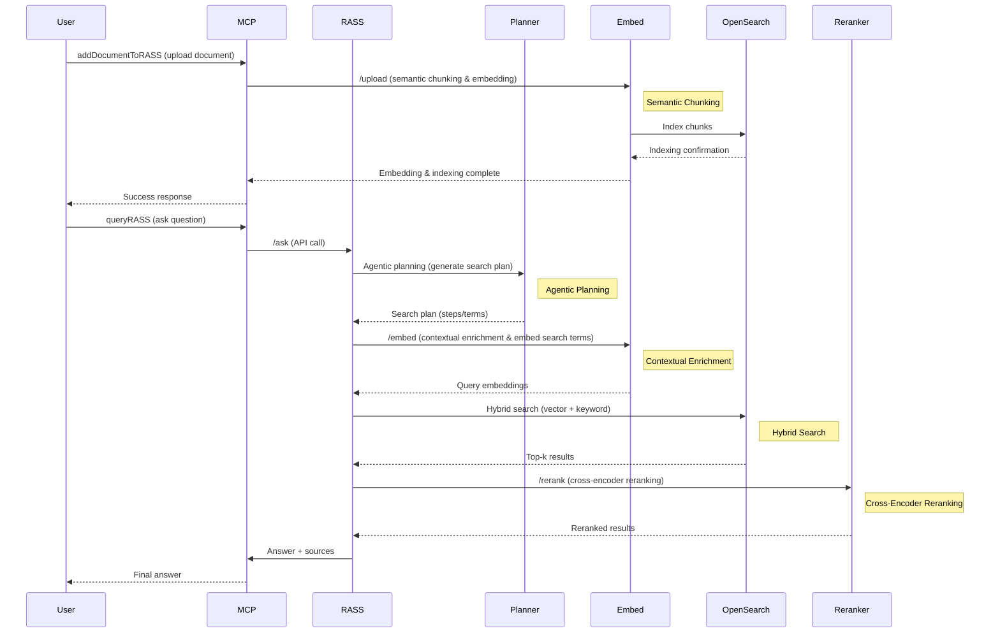
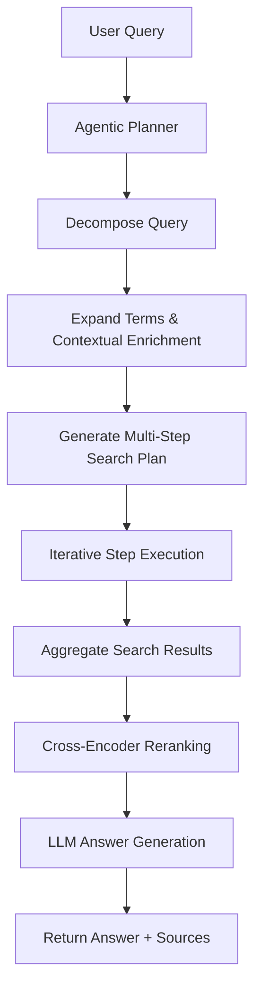

# Agentic Planner Documentation

## Overview

The Agentic Planner is a key component of the RASS (Retrieval Augmented Semantic Search) engine that intelligently generates search strategies for user queries. It uses Large Language Models (LLMs) to decompose and expand queries into multiple search terms, improving retrieval coverage and relevance.

## Architecture

### Component Location

- **File**: `rass-engine-service/agenticPlanner.js`
- **Integration**: Called by the `/ask` endpoint in `index.js`

### Key Features

- Dynamic search plan generation using LLMs (OpenAI or Gemini)
- Query decomposition and expansion
- History-aware planning to avoid repetitive strategies
- Configurable LLM backend

---

## Microservices Overview

| Service             | Description                                                            | Tech Stack       | Key Endpoints/Ports |
| ------------------- | ---------------------------------------------------------------------- | ---------------- | ------------------- |
| rass-engine-service | Orchestrates the RAG pipeline, agentic planning, and answer generation | Node.js, Express | `/ask` (8000)       |
| embedding-service   | Handles text embedding and chunking, interfaces with OpenSearch        | Node.js          | `/embed` (8001)     |
| py_reranker         | Reranks retrieved documents using a cross-encoder model                | Python, FastAPI  | `/rerank` (8008)    |
| opensearch_node     | Vector database for semantic search                                    | OpenSearch       | 9200/9300           |
| mcp-server          | MCP protocol server for client integration                             | Node.js          | `/mcp` (8080)       |

---

## MCP Server & Tools

### What is the MCP Server?

The **MCP (Model Context Protocol) Server** acts as the main integration point between external clients (such as test clients, UI, or other systems) and the RASS engine. It exposes a standardized API for document ingestion, querying, and evaluation, making it easy to connect RASS to other platforms or automation scripts.

- **Location:** `mcp-server/`
- **Tech Stack:** Node.js, Express
- **Key Endpoint:** `/mcp` (port 8080)

### MCP Tools and Their Purpose

The MCP server exposes several "tools" (API endpoints) that orchestrate the RASS pipeline:

| Tool Name           | Purpose                                                                                                                                                                                      |
| ------------------- | -------------------------------------------------------------------------------------------------------------------------------------------------------------------------------------------- |
| `addDocumentToRASS` | Uploads and indexes a new document into the RASS system. Handles chunking and embedding.                                                                                                     |
| `queryRASS`         | Submits a user query to the RASS engine and returns the generated answer and sources.                                                                                                        |
| 

#### Tool Workflow Example

1. **addDocumentToRASS**:

   - Client uploads a document (e.g., PDF, Markdown).
   - MCP server calls the embedding service to chunk and embed the document.
   - Chunks are indexed in OpenSearch for retrieval.

2. **queryRASS**:

   - Client submits a question.
   - MCP server forwards the query to the RASS engine (`/ask` endpoint).
   - RASS engine runs the agentic planner, retrieves and reranks results, and generates an answer.
   - MCP server returns the answer and supporting documents to the client.

### Why MCP?

- **Standardization:** Provides a unified interface for all RASS operations.
- **Automation:** Enables batch testing, evaluation, and integration with CI/CD or external platforms.
- **Extensibility:** New tools can be added to support additional workflows or integrations.

---

## System Interaction Diagram

---

## Key Concepts Explained

- **Semantic Chunking:** The process of splitting documents into semantically meaningful chunks before embedding and indexing. Performed by the embedding-service during document ingestion.
- **Contextual Enrichment:** Enhancing search terms or queries with additional context (e.g., history, synonyms, or LLM-generated expansions) before embedding. Performed by the agentic planner and embedding-service.
- **Agentic Planning:** The use of an LLM to decompose and expand user queries into a multi-step search plan, improving retrieval coverage and relevance.
- **Hybrid Search:** Combining vector similarity search (using embeddings) with traditional keyword search in OpenSearch to maximize recall and precision.
- **Cross-Encoder Reranking:** Using a cross-encoder model to semantically rerank the top-k retrieved chunks, ensuring the most relevant results are prioritized for answer generation.

These concepts are illustrated in the diagram above at the relevant steps in the workflow.

---

## Agentic Planner Workflow

The Agentic Planner takes a user query and, using an LLM, generates a multi-step search plan. Each step may include:

- Query decomposition (breaking down complex questions)
- Expansion (adding synonyms, related terms, or context)
- Contextual enrichment (adding background, history, or clarifying information)
- Iterative refinement (using previous results to improve the plan)
- Step-by-step execution (each search step can trigger further planning)

### Detailed Workflow Diagram

---

### Step-by-Step Explanation

1. **Decompose Query:** The planner breaks down complex or multi-part questions into simpler sub-questions or search intents.
2. **Expand Terms & Contextual Enrichment:** The planner expands search terms with synonyms, related concepts, or additional context (e.g., time period, location, background info).
3. **Generate Multi-Step Search Plan:** The planner creates a sequence of search steps, each targeting a specific aspect of the query.
4. **Iterative Step Execution:** The system executes each search step, optionally refining the plan based on intermediate results.
5. **Aggregate Search Results:** Results from all steps are combined and deduplicated.
6. **Cross-Encoder Reranking:** The top results are reranked using a cross-encoder model for semantic relevance.
7. **LLM Answer Generation:** The final answer is generated by the LLM using the reranked context.
8. **Return Answer + Sources:** The answer and supporting document sources are returned to the user.

This workflow enables the system to handle complex, multi-faceted queries with high relevance and faithfulness.

---

## How It Works

1. **User submits a query** via the MCP client.
2. **Agentic Planner** (in `agenticPlanner.js`) uses an LLM to break down the query into multiple search terms and steps.
3. **Search terms** are embedded and sent to OpenSearch for vector retrieval.
4. **Top results** are reranked by the `py_reranker` microservice using a cross-encoder model.
5. **RASS engine** aggregates the reranked results and generates a final answer using an LLM.
6. **Answer and sources** are returned to the user.

---

## Example: Search Plan Generation

- **Input Query:** "What was the initial object that fell to Earth from Mars in War of The Worlds?"
- **Generated Plan:**
  1. Search for "Mars meteorite"
  2. Search for "Martian object"
  3. Search for "extraterrestrial rock"

---

## Technical Implementation

- **LLM Integration:** Supports OpenAI and Gemini for planning and answer generation.
- **Prompt Engineering:** Prompts are designed to encourage decomposition and expansion of queries.
- **Context Enrichment:** Planner can use previous search history to avoid redundant steps.
- **Hybrid Search:** Combines vector search (OpenSearch) with semantic reranking (py_reranker).

---

## Performance & Limitations

- **Document Capacity:** Tested with up to 10,000 chunks per document.
- **RAM/CPU:** Minimum 8GB RAM recommended for py_reranker; more for large-scale deployments.
- **Known Limitations:**
  - Current answer generation is conservative; may not synthesize answers from partial context.
  - Answer relevancy is being improved (see evaluation results).
  - System performance depends on LLM and embedding model quotas.
  - Context Generation causes high latency since each chunk is processed sequentially and sent to the LLM to generate context causing a bottleneck. Can toggle Context Generation off in `agenticPlanner.js` to speed up the process, but at the cost of potentially less relevant answers.

---

## How to Extend

- **Add new microservices** by updating `docker-compose.yml` and ensuring network connectivity.
- **Swap out models** by changing environment variables and updating service code.
- **Tune planner prompts** in `agenticPlanner.js` for better decomposition or domain adaptation.

---

## References

- [OpenAI API](https://platform.openai.com/docs/)
- [Google Gemini API](https://ai.google.dev/)
- [Sentence Transformers](https://www.sbert.net/)
- [OpenSearch Documentation](https://opensearch.org/docs/)

---

_For more details, see the README and individual service documentation._
