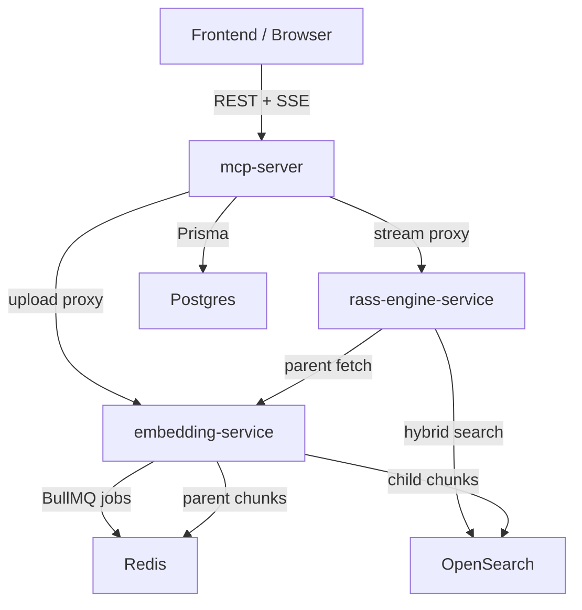
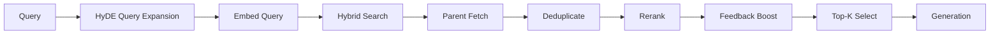
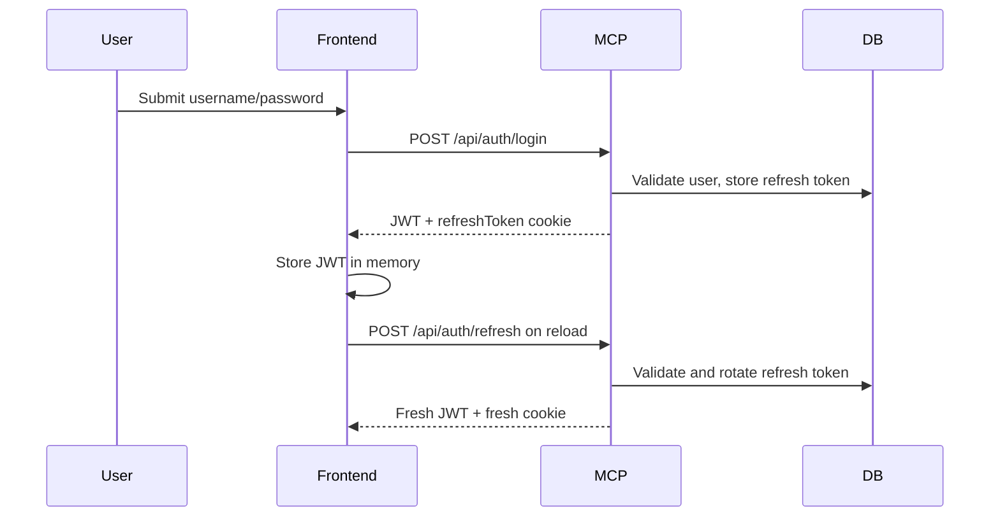
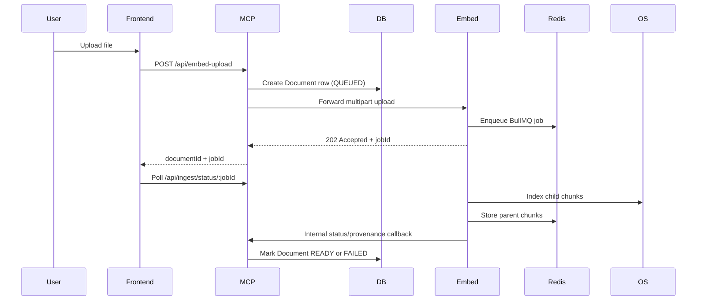
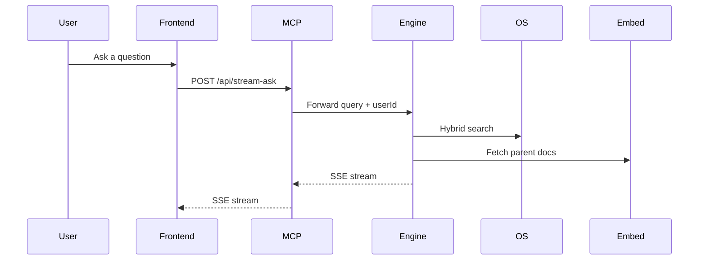

# RASS Architecture and Runtime Flows

This document describes the current architecture in code. The older "agentic planner" writeup is no longer the correct mental model for the active system.

## Current System Shape

CoRAG is composed of four main application pieces:

- `frontend`: React client for auth, chat, uploads, and document management
- `mcp-server`: API gateway and application control plane
- `rass-engine-service`: retrieval and answer generation
- `embedding-service`: asynchronous ingestion and indexing

Supporting infrastructure:

- OpenSearch
- Redis
- Postgres
- Jaeger
- Prometheus
- Grafana
- Loki
- Promtail
- Optional Ollama

## Architecture Diagram

```mermaid
flowchart TD
    Browser["Frontend / Browser"]
    MCP["mcp-server"]
    Engine["rass-engine-service"]
    Embed["embedding-service"]
    OS["OpenSearch"]
    Redis["Redis"]
    PG["Postgres"]

    Browser -->|REST + SSE| MCP
    MCP -->|upload proxy| Embed
    MCP -->|stream proxy| Engine
    MCP -->|Prisma| PG
    Engine -->|hybrid search| OS
    Engine -->|parent fetch| Embed
    Embed -->|BullMQ jobs| Redis
    Embed -->|parent chunks| Redis
    Embed -->|child chunks| OS
```

## Responsibilities by Service

### `mcp-server`

- Auth and session lifecycle
- Chat CRUD and message persistence
- Document registry and provenance APIs
- Knowledge base and workspace management
- API keys, audit routes, and admin workflows
- MCP JSON-RPC transport
- Upload proxy to `embedding-service`
- Streaming query proxy to `rass-engine-service`

### `rass-engine-service`

- Non-streaming `POST /ask`
- Streaming `POST /stream-ask`
- Retrieval pipeline orchestration
- LLM answer generation
- SSE context and citation events

### `embedding-service`

- Upload intake
- BullMQ queueing
- Parse/chunk/embed/index worker
- Redis-backed parent document storage
- Provenance callbacks into `mcp-server`

### `frontend`

- Login, logout, silent refresh
- Chat creation and selection
- File upload and ingestion progress polling
- Live token streaming
- Context/citation display
- Document management UI

## Current Retrieval Pipeline

The active retrieval path is assembled in `rass-engine-service/src/retrieval/createPipeline.js`.

```mermaid
flowchart LR
    Q["Query"] --> H["HyDE Query Expansion"]
    H --> E["Embed Query"]
    E --> S["Hybrid Search"]
    S --> P["Parent Fetch"]
    P --> D["Deduplicate"]
    D --> R["Rerank"]
    R --> F["Feedback Boost"]
    F --> T["Top-K Select"]
    T --> G["Generation"]
```

Stages:

1. `HydeQueryExpansionStage`
2. `EmbedQueryStage`
3. `HybridSearchStage`
4. `ParentFetchStage`
5. `DeduplicateStage`
6. `RerankStage`
7. `FeedbackBoostStage`
8. `TopKSelectStage`

Important caveat: the retrieval pipeline currently searches the configured default OpenSearch index. Per-KB and per-workspace index provisioning exists in the control plane, but the active retrieval stage does not yet switch indices dynamically.

## Data Model

### Durable application data in Postgres

- `User`
- `Chat`
- `Message`
- `ChatDocument`
- `Document`
- `DocumentProvenance`
- `KnowledgeBase`
- `KBMember`
- `Organization`
- `OrgMember`
- `Workspace`
- `WorkspaceMember`
- `ApiKey`
- `RefreshToken`
- `AuditLog`
- `RetrievalFeedback`
- `Entity`
- `Relation`
- `Annotation`
- `SharedChat`

### Search and queue data

- OpenSearch stores searchable child chunks
- Redis stores BullMQ state and parent chunks

## Request Flows

### 1. Login and session restoration

```mermaid
sequenceDiagram
    participant User
    participant Frontend
    participant MCP
    participant DB

    User->>Frontend: Submit username/password
    Frontend->>MCP: POST /api/auth/login
    MCP->>DB: Validate user, store refresh token
    MCP-->>Frontend: JWT + refreshToken cookie
    Frontend->>Frontend: Store JWT in memory

    Frontend->>MCP: POST /api/auth/refresh on reload
    MCP->>DB: Validate and rotate refresh token
    MCP-->>Frontend: Fresh JWT + fresh cookie
```

Notes:

- The frontend does not use localStorage for the active JWT.
- Refresh tokens are HTTP-only cookies scoped to `/api/auth/refresh`.
- API clients can also authenticate with `Authorization: ApiKey <raw_key>`.

### 2. Upload and ingestion

```mermaid
sequenceDiagram
    participant User
    participant Frontend
    participant MCP
    participant DB
    participant Embed
    participant Redis
    participant OS

    User->>Frontend: Upload file
    Frontend->>MCP: POST /api/embed-upload
    MCP->>DB: Create Document row (QUEUED)
    MCP->>Embed: Forward multipart upload
    Embed->>Redis: Enqueue BullMQ job
    Embed-->>MCP: 202 Accepted + jobId
    MCP-->>Frontend: documentId + jobId
    Frontend->>MCP: Poll /api/ingest/status/:jobId
    Embed->>OS: Index child chunks
    Embed->>Redis: Store parent chunks
    Embed->>MCP: Internal status/provenance callback
    MCP->>DB: Mark Document READY or FAILED
```

### 3. Query and answer streaming

```mermaid
sequenceDiagram
    participant User
    participant Frontend
    participant MCP
    participant Engine
    participant OS
    participant Embed

    User->>Frontend: Ask a question
    Frontend->>MCP: POST /api/stream-ask
    MCP->>Engine: Forward query + userId
    Engine->>OS: Hybrid search
    Engine->>Embed: Fetch parent docs
    Engine-->>MCP: SSE stream
    MCP-->>Frontend: SSE stream
```

Event order for successful streams:

1. `context`
2. text token deltas
3. `citations`
4. `[DONE]`

## Frontend Architecture

### Auth

- `AuthContext` owns the in-memory JWT
- Silent refresh happens on app load
- Logout clears the refresh cookie server-side and legacy local storage client-side

### Chat state

- `ChatContext` owns chat list and active chat state
- The UI persists chats on the server and also contains local fallback behavior

### Main user-visible surfaces

- Auth page
- Main chat layout
- Sidebar with chat management
- Chat input with upload support
- Document manager
- Context panel for retrieved chunks
- Shared-chat route component

## Observability

### Metrics

- Each backend service exposes `/metrics`
- Prometheus scrapes the services
- Grafana dashboards are provisioned from `monitoring/`

### Tracing

- OpenTelemetry initializes before the rest of each backend service
- Jaeger receives OTLP traces

### Logging

- Structured logging with correlation IDs
- Loki + Promtail for aggregation

## Known Design Gaps

- Root compose does not include the standard frontend.
- Shared-chat code is not fully aligned with the current Prisma `Message` shape.
- The repo contains both a document-similarity graph concept and an entity/relation knowledge graph concept.
- Some frontend components still carry legacy token assumptions, but the canonical auth path is in-memory JWT plus refresh cookie.

## Canonical Source of Truth

For current behavior, trust runtime code in this order:

1. service entrypoints and route files
2. Prisma schema and config loaders
3. compose files and scripts
4. higher-level documentation
