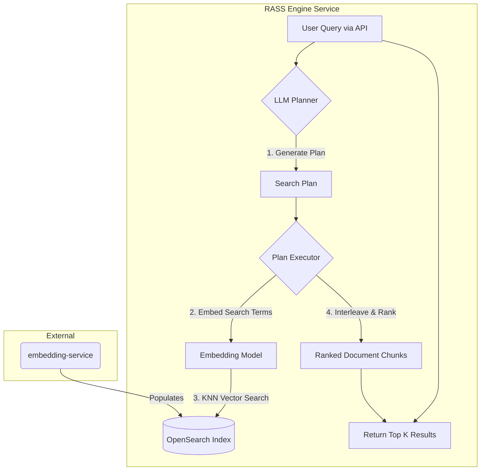

# 🧠 RASS Engine Service

This is the querying backend of the `enhanced-rass` project. It provides an intelligent, agentic search layer over a vector database. The service interprets natural language queries, uses a configurable LLM to generate a multi-step search plan, executes that plan against a specified OpenSearch index, and returns the most relevant documents.

This service is intended to be run as part of the Docker Compose environment defined in the root of the `enhanced-rass` repository.

---


## ⚙️ Core Features

-   **Agentic LLM Planner:** Leverages a configurable LLM provider (**OpenAI** or **Google Gemini**) to decompose user queries into a series of precise vector search terms.
-   **Provider-Aware Search:** Dynamically uses the correct embedding model (OpenAI or Gemini) to embed search terms, ensuring compatibility with the target OpenSearch index.
-   **Interleaved Multi-Entity Retrieval:** Executes a multi-step search plan and interleaves the results to ensure balanced relevance across different facets of the original query.
-   **Configurable and Containerized:** All models, providers, and search parameters are configurable via environment variables, and the service is designed to run within the main project's Docker Compose setup.

---

## 🧰 Tech Stack

| Component                | Technology                                         |
| ------------------------ | -------------------------------------------------- |
| API Server               | Node.js + Express.js                               |
| LLM Planner              | Configurable (OpenAI GPT-4o, Gemini Flash, etc.)   |
| Search Term Embeddings   | Configurable (OpenAI, Gemini)                      |
| Search Engine            | OpenSearch (HNSW, KNN)                             |
| API                      | REST (`/ask`) & WebSocket (`/ws/ask`)               |

---

## 🌱 Environment Configuration

This service is configured via a `.env` file located in its directory (`rass-engine-service/.env`).

Key variables:

-   `LLM_PLANNER_PROVIDER`: Set to `openai` or `gemini` to select the provider for the agentic planner.
-   `OPENAI_PLANNER_MODEL` / `GEMINI_PLANNER_MODEL`: The specific planner model to use.
-   `SEARCH_TERM_EMBED_PROVIDER`: Set to `openai` or `gemini`. **Must match the provider used by the `embedding-service` to populate your target index.**
-   `OPENAI_API_KEY` / `GEMINI_API_KEY`: API keys for your chosen providers.
-   `OPENSEARCH_HOST`: Should be set to `opensearch`.
-   `OPENSEARCH_INDEX_NAME`: **Crucially, this must match the full index name created by the `embedding-service`** (e.g., `knowledge_base_gemini_text-embedding-004`).
-   `EMBED_DIM`: The vector dimension. **Must match the dimension of the target index.**
-   `OPENSEARCH_SCORE_THRESHOLD`: The minimum similarity score (0.0-1.0) for a document to be considered a match.

**Example `.env`:**
```ini
# --- Provider Selection ---
# "openai" or "gemini"
LLM_PLANNER_PROVIDER=openai
SEARCH_TERM_EMBED_PROVIDER=gemini # Must match the provider used for ingestion

# --- Model & API Key Configuration ---
OPENAI_API_KEY=sk-...
OPENAI_PLANNER_MODEL=gpt-4o-mini

GEMINI_API_KEY=...
GEMINI_PLANNER_MODEL=gemini-1.5-flash-latest
# Note: The GEMINI_EMBED_MODEL is not needed here; it's determined by SEARCH_TERM_EMBED_PROVIDER

# --- OpenSearch Configuration ---
OPENSEARCH_HOST=opensearch
OPENSEARCH_PORT=9200
OPENSEARCH_INDEX_NAME=knowledge_base_gemini_text-embedding-004 # IMPORTANT: Target the correct index!
EMBED_DIM=768 # IMPORTANT: Must match the target index's dimension

# --- RASS Engine Configuration ---
DEFAULT_K=25
OPENSEARCH_SCORE_THRESHOLD=0.7
```

---

## 🚀 Running the Service

This service is not intended to be run standalone. Please refer to the **main `README.md`** in the root of the `enhanced-rass` repository for instructions on how to start the entire application stack using `docker-compose up`.

---

## 🔌 API Endpoint: `POST /ask`

Accepts a natural language query and returns the most relevant document chunks. The service is accessible at `http://localhost:8000` when running via Docker Compose.

### Request

```json
{
  "query": "Describe the Martians as they are described in the War of the Worlds.",
  "top_k": 5
}
```

### ✅ Success Response

```json
{
  "documents": [
    {
      "doc_id": "....txt-chunk235",
      "file_path": "uploads/....txt",
      "file_type": "txt",
      "text_chunk": "...",
      "score": 0.76525956
    }
  ]
}
```